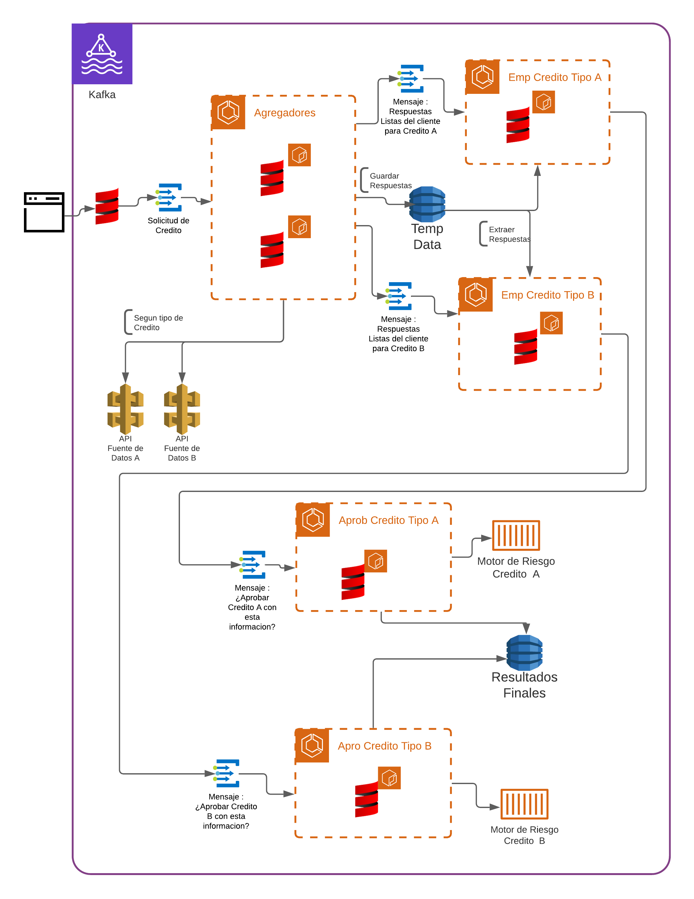
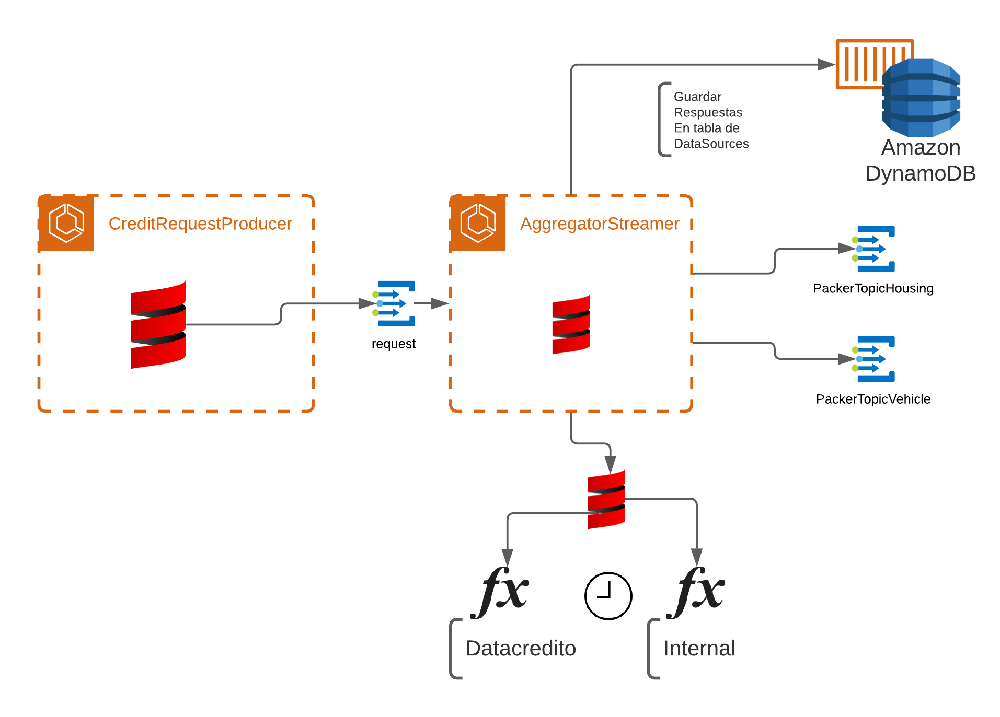
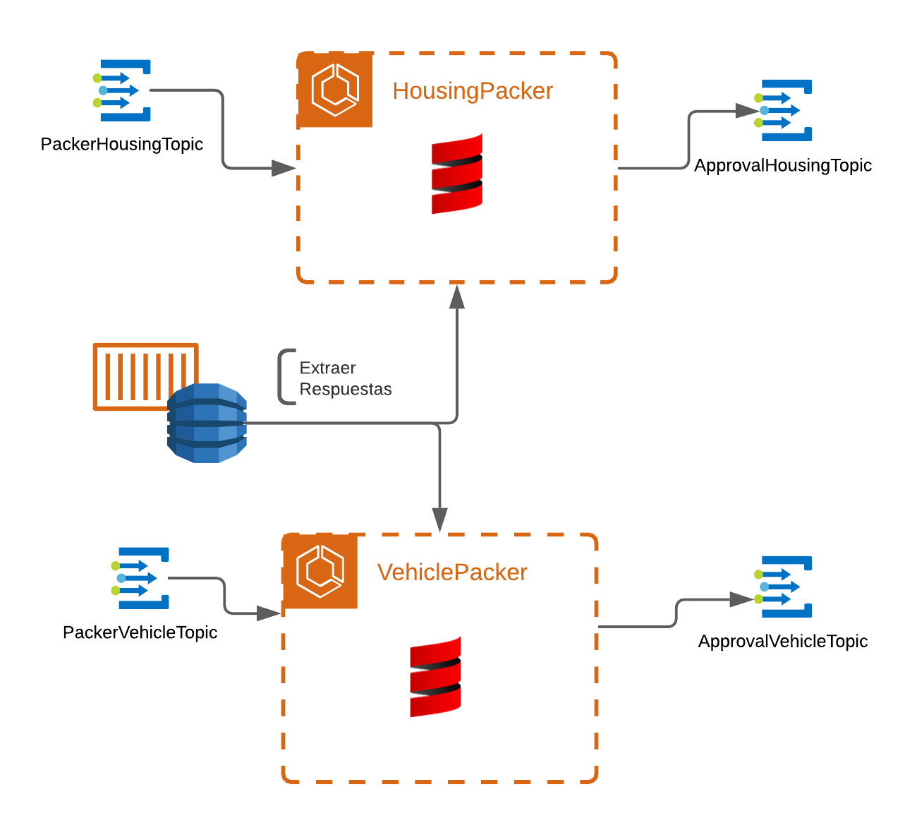
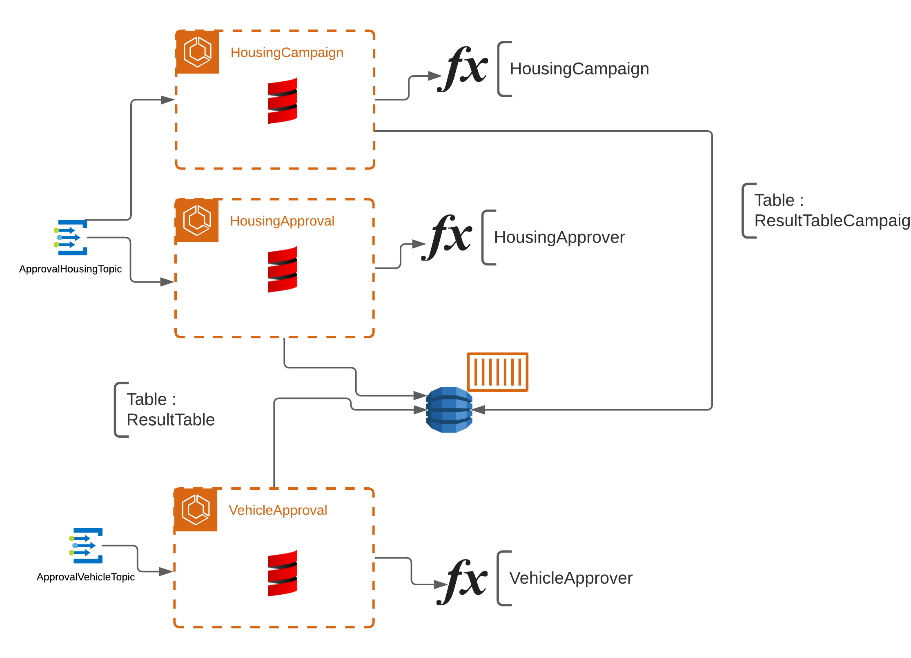

# Proyecto PFSD Agregadores y Aprobadores de Credito (Kafka - Scala)

# [PDF Proyect (Link)](readmefiles/Flujo_de_Agregadores_de_Informaci_n_y_de_Aprobaciones_Financieras.pdf)

Desde siempre la toma de productos financieros (el estudio y toma de decision) ha sido
un proceso extremadamente largo y tedioso tanto para el cliente que solicita un producto
de estos como para al entidad financiera al ejecutar el estudio (calcular el riesgo). Se ha
logrado llegar al punto de digitalizar procesos de obtencion de informacion a base de datos
externas (servicios de terceros) para completar dicha informacion, pero siguen habiendo
procesos manuales , debido a que no se tiene una infraestructura lo suficientemente flexible
o transparente que permita optimizar el proceso sin incurrir en gastos adicionales y que deje
de ser rentable ser implementado. O bien porque se tiene un sistema que puede realizar
dicho proceso de forma digital a completo pero no tiene las prestaciones de la programación
funcional y herramientas/frameworks mas adecuados , optimizados y entendibles que actuales
implementaciones. Se lograra dar con una solucion mas adecuada y optimizada utilizando
Kafka con Scala. [...]

## Implementacion final

### Dyanmo Instance

### [Crear Instancia Local Dynamo (link)](dockerYamls/Dynamo/UseFullCommands.md)

### Agregadores 

### Empaquetadores

### Aprobadores

